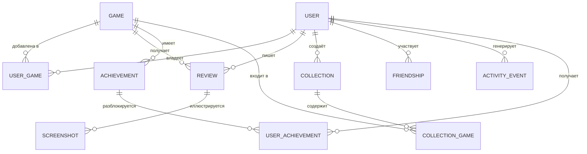

# Модель данных

Черновая модель для MVP + заложенные поля под S/C-функции. Финальные
типы полей уточняются на этапе выбора ORM/СУБД (см. [05-architecture.md](05-architecture.md)).

**Статус (2026-09-04):** `User`, `Game`, `UserGame` реализованы в
[prisma/schema.prisma](../prisma/schema.prisma) как часть MVP —
без изменений полей относительно черновика ниже (имена в camelCase
по конвенции Prisma/TS вместо snake_case).

**Обновление (этап 2):** реализованы `Friendship` (запрос/принятие,
статусы `PENDING`/`ACCEPTED`/`DECLINED`, одна строка на пару) и новая
сущность `Follow` (односторонняя подписка). В `User` добавлено поле
`privacy` (`PUBLIC`/`PRIVATE`) — базовая версия F4. Поиск профилей по
`username` регистронезависимый, хотя уникальность в БД регистрозависима
(для pet-проекта приемлемо). `Review`, `Screenshot`, `Collection`,
`Achievement`, `ActivityEvent` пока не реализованы — Этапы 2–3.

### Follow (односторонняя подписка)

| Поле | Тип | Комментарий |
|---|---|---|
| id | UUID | PK |
| follower_id | UUID | FK → User (кто подписался) |
| following_id | UUID | FK → User (за кем следят) |
| created_at | datetime | |

Уникальность: (`follower_id`, `following_id`).

## Сущности

### User
Аккаунт пользователя.

| Поле | Тип | Комментарий |
|---|---|---|
| id | UUID | PK |
| email | string, unique | |
| password_hash | string | null, если вход только через OAuth |
| username | string, unique | публичный ник |
| display_name | string | |
| avatar_url | string | загружается в Vercel Blob |
| bio | text | |
| privacy | enum(public, private) | F4 — реализовано; `friends` как отдельный режим позже |
| created_at | datetime | |

### Game (локальный кэш внешнего API)
Мы не храним "мастер-копию" каталога — храним кэш того, что показывали
пользователю, плюс внешний идентификатор.

| Поле | Тип | Комментарий |
|---|---|---|
| id | UUID | PK, внутренний |
| external_source | enum(igdb, rawg) | откуда пришла запись |
| external_id | string | id в источнике |
| title | string | |
| cover_url | string | |
| genres | string[] | |
| platforms | string[] | |
| release_date | date | |
| summary | text | |
| cached_at | datetime | для инвалидации кэша |

Уникальность: (`external_source`, `external_id`).

### UserGame (запись библиотеки — ядро продукта)

| Поле | Тип | Комментарий |
|---|---|---|
| id | UUID | PK |
| user_id | UUID | FK → User |
| game_id | UUID | FK → Game |
| status | enum(want_to_play, playing, completed, dropped, on_hold) | F6 |
| progress_percent | int 0–100 | nullable, F7 |
| hours_played | decimal | nullable, F7 |
| rating | int 1–10 | nullable, F8 |
| started_at | date | nullable |
| finished_at | date | nullable |
| notes | text | приватная заметка пользователя |
| updated_at | datetime | источник для ленты активности |

Уникальность: (`user_id`, `game_id`) — одна запись библиотеки на игру.

### Review (развёрнутый отзыв, отдельно от быстрой оценки в UserGame)

| Поле | Тип | Комментарий |
|---|---|---|
| id | UUID | PK |
| user_id | UUID | FK → User |
| game_id | UUID | FK → Game |
| rating | int 1–10 | может дублировать/переопределять UserGame.rating |
| body | text | |
| is_hidden | boolean | задел под модерацию |
| created_at | datetime | |

### Screenshot

| Поле | Тип | Комментарий |
|---|---|---|
| id | UUID | PK |
| user_id | UUID | FK → User |
| game_id | UUID | FK → Game, nullable |
| review_id | UUID | FK → Review, nullable |
| file_url | string | путь в файловом хранилище |
| created_at | datetime | |

### Collection / CollectionGame (коллекции игр)

**Collection**: id, user_id (FK), title, description, is_public, created_at.
**CollectionGame**: collection_id (FK), game_id (FK), sort_order — связь many-to-many.

### Achievement / UserAchievement

**Achievement**: id, game_id (FK, nullable для внутренних ачивок GameHub),
title, description, icon_url, source (enum: external, internal).
**UserAchievement**: user_id (FK), achievement_id (FK), unlocked_at.

### Friendship (граф друзей)

| Поле | Тип | Комментарий |
|---|---|---|
| id | UUID | PK |
| requester_id | UUID | FK → User |
| addressee_id | UUID | FK → User |
| status | enum(pending, accepted, declined, blocked) | |
| created_at | datetime | |

### ActivityEvent (лента активности — денормализованная для скорости чтения)

| Поле | Тип | Комментарий |
|---|---|---|
| id | UUID | PK |
| user_id | UUID | кто совершил действие |
| type | enum(added_game, status_changed, rated, reviewed, achievement_unlocked) | |
| payload | jsonb | контекст события (game_id, старый/новый статус и т.д.) |
| created_at | datetime | |

Генерируется как побочный эффект действий (F6–F8, F11, F15), читается
для ленты друзей (F14).

## ER-диаграмма (упрощённо)

## Заметки по проектированию

- `Game` — это кэш, а не источник правды. При показе игры на сайте
  всегда указываем атрибуцию источника (обязательно по условиям
  большинства игровых API).
- Статистика аккаунта (F9) считается на лету агрегацией по `UserGame`,
  отдельная таблица для неё на MVP не нужна — можно добавить
  материализованное представление позже, если станет медленно.
- Поле `is_hidden` в `Review` и будущий `status` в `Friendship`
  — минимальный задел под модерацию, не полноценная система жалоб.
