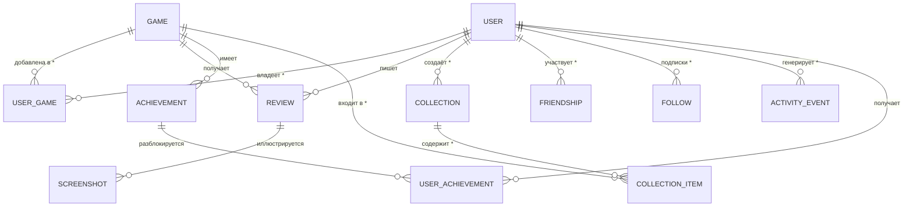

# Модель данных

Черновая модель для MVP + заложенные поля под S/C-функции. Финальные
типы полей уточняются на этапе выбора ORM/СУБД (см. [05-architecture.md](05-architecture.md)).

**Статус (2026-09-04):** `User`, `Game`, `UserGame` реализованы в
[prisma/schema.prisma](../prisma/schema.prisma) как часть MVP —
без изменений полей относительно черновика ниже (имена в camelCase
по конвенции Prisma/TS вместо snake_case).

**Обновление (этап 2):** реализованы `Friendship` (запрос/принятие,
статусы `PENDING`/`ACCEPTED`/`DECLINED`, одна строка на пару) и новая
сущность `Follow` (односторонняя подписка). В `User` добавлено поле
`privacy` (`PUBLIC`/`PRIVATE`) — базовая версия F4. Поиск профилей по
`username` регистронезависимый, хотя уникальность в БД регистрозависима
(для pet-проекта приемлемо).

**Обновление (2026-09-06):** реализованы `Collection` / `CollectionItem`
(F10) и `ActivityEvent` (F14) — см. разделы ниже. `Review`, `Screenshot`,
`Achievement` пока не реализованы — Этапы 2–3.

### Follow (односторонняя подписка)

| Поле | Тип | Комментарий |
|---|---|---|
| id | UUID | PK |
| follower_id | UUID | FK → User (кто подписался) |
| following_id | UUID | FK → User (за кем следят) |
| created_at | datetime | |

Уникальность: (`follower_id`, `following_id`).

## Сущности

### User
Аккаунт пользователя.

| Поле | Тип | Комментарий |
|---|---|---|
| id | UUID | PK |
| email | string, unique | |
| password_hash | string | null, если вход только через OAuth |
| username | string, unique | публичный ник |
| display_name | string | |
| avatar_url | string | загружается в Vercel Blob |
| bio | text | |
| privacy | enum(public, private) | F4 — реализовано; `friends` как отдельный режим позже |
| created_at | datetime | |

### Game (локальный кэш внешнего API)
Мы не храним "мастер-копию" каталога — храним кэш того, что показывали
пользователю, плюс внешний идентификатор.

| Поле | Тип | Комментарий |
|---|---|---|
| id | UUID | PK, внутренний |
| external_source | enum(igdb, rawg) | откуда пришла запись |
| external_id | string | id в источнике |
| title | string | |
| cover_url | string | |
| genres | string[] | |
| platforms | string[] | |
| release_date | date | |
| summary | text | |
| cached_at | datetime | для инвалидации кэша |

Уникальность: (`external_source`, `external_id`).

### UserGame (запись библиотеки — ядро продукта)

| Поле | Тип | Комментарий |
|---|---|---|
| id | UUID | PK |
| user_id | UUID | FK → User |
| game_id | UUID | FK → Game |
| status | enum(want_to_play, playing, completed, dropped, on_hold) | F6 |
| progress_percent | int 0–100 | nullable, F7 |
| hours_played | decimal | nullable, F7 |
| rating | int 1–10 | nullable, F8 |
| started_at | date | nullable; авто-ставится при переводе в статус «играю» |
| finished_at | date | nullable; авто-ставится при переводе в «пройдено» |
| notes | text | приватная заметка пользователя; редактируется на `/games/[id]` |
| updated_at | datetime | задел под ленту активности (F14 не реализована) |

Уникальность: (`user_id`, `game_id`) — одна запись библиотеки на игру.
Реализовано в MVP; поля `started_at` / `finished_at` / `notes` тоже
подключены к UI (карточка игры).

### Review (развёрнутый отзыв, отдельно от быстрой оценки в UserGame)

| Поле | Тип | Комментарий |
|---|---|---|
| id | UUID | PK |
| user_id | UUID | FK → User |
| game_id | UUID | FK → Game |
| rating | int 1–10 | может дублировать/переопределять UserGame.rating |
| body | text | |
| is_hidden | boolean | задел под модерацию |
| created_at | datetime | |

### Screenshot

| Поле | Тип | Комментарий |
|---|---|---|
| id | UUID | PK |
| user_id | UUID | FK → User |
| game_id | UUID | FK → Game, nullable |
| review_id | UUID | FK → Review, nullable |
| file_url | string | путь в файловом хранилище |
| created_at | datetime | |

### Collection / CollectionItem (коллекции игр) — F10, реализовано

**Collection**: id, `userId` (FK → User), `name`, `description` (nullable),
`isPublic` (default true), `createdAt`, `updatedAt`.
Уникальность: (`userId`, `name`) — у пользователя не может быть двух
коллекций с одинаковым именем.

**CollectionItem**: id, `collectionId` (FK → Collection), `gameId` (FK → Game),
`addedAt`. Уникальность: (`collectionId`, `gameId`).

Отличия от исходного черновика: поле называется `name`, а не `title`;
связующая таблица — `CollectionItem` без `sort_order` (порядок пока по
времени добавления); в коллекцию можно добавить только игру, уже
находящуюся в библиотеке пользователя (нельзя добавить произвольную
игру из RAWG напрямую — чтобы не плодить «осиротевшие» записи `Game`).
`isPublic` в схеме есть, но публичного просмотра чужих коллекций пока
нет — все коллекции видит только владелец.

### Achievement / UserAchievement

**Achievement**: id, game_id (FK, nullable для внутренних ачивок GameHub),
title, description, icon_url, source (enum: external, internal).
**UserAchievement**: user_id (FK), achievement_id (FK), unlocked_at.

### Friendship (граф друзей) — реализовано

| Поле | Тип | Комментарий |
|---|---|---|
| id | UUID | PK |
| requester_id | UUID | FK → User |
| addressee_id | UUID | FK → User |
| status | enum(PENDING, ACCEPTED, DECLINED) | `BLOCKED` из черновика не реализован |
| created_at | datetime | |
| updated_at | datetime | |

Уникальность: (`requester_id`, `addressee_id`). Одна строка на пару:
повторная заявка после отказа переиспользует строку (см.
`src/lib/actions/social.ts`). Блокировки пользователей нет.

### ActivityEvent (лента активности — денормализованная) — F14, реализовано

| Поле | Тип | Комментарий |
|---|---|---|
| id | UUID | PK |
| userId | UUID | FK → User, кто совершил действие |
| type | enum(ADDED_GAME, STARTED_PLAYING, COMPLETED, RATED) | `REVIEWED` / `ACHIEVEMENT_UNLOCKED` — позже |
| payload | Json | `{ id, externalId, title, coverUrl, rating? }` — данные об игре денормализованы целиком |
| createdAt | datetime | |

Индексы: `(userId, createdAt)`, `(createdAt)`. Генерируется best-effort из
`src/lib/actions/library.ts` (F6–F8); лента читается `getFeed()` в
`src/lib/activity.ts`. Игра в payload хранится целиком, чтобы лента
читалась без джойнов и переживала удаление кэша `Game`.

## ER-диаграмма (упрощённо)

Реализованные сущности отмечены `*`; остальные — задел под Этапы 2–3.

## Заметки по проектированию

- `Game` — это кэш, а не источник правды. При показе игры на сайте
  всегда указываем атрибуцию источника (обязательно по условиям
  большинства игровых API).
- Статистика аккаунта (F9) считается на лету агрегацией по `UserGame`
  (`src/lib/stats.ts`), отдельная таблица для неё на MVP не нужна —
  можно добавить материализованное представление позже, если станет
  медленно.
- Поле `is_hidden` в `Review` — минимальный задел под модерацию, не
  полноценная система жалоб. (В `Friendship` `status` — это состояние
  заявки в друзья, не модерация; статуса `BLOCKED` нет.)
- Видимость чужой библиотеки/статистики (`src/lib/social.ts`,
  `libraryVisible`): свою всегда видно; `PUBLIC`-профиль виден любому
  залогиненному; `PRIVATE` — только принятым друзьям.
